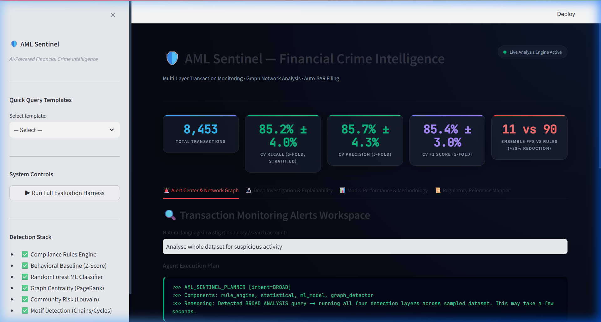
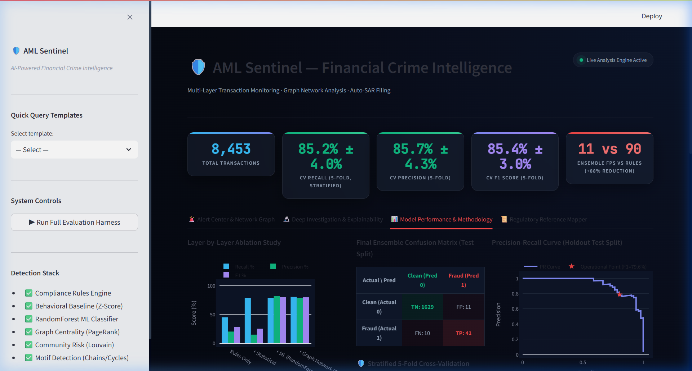
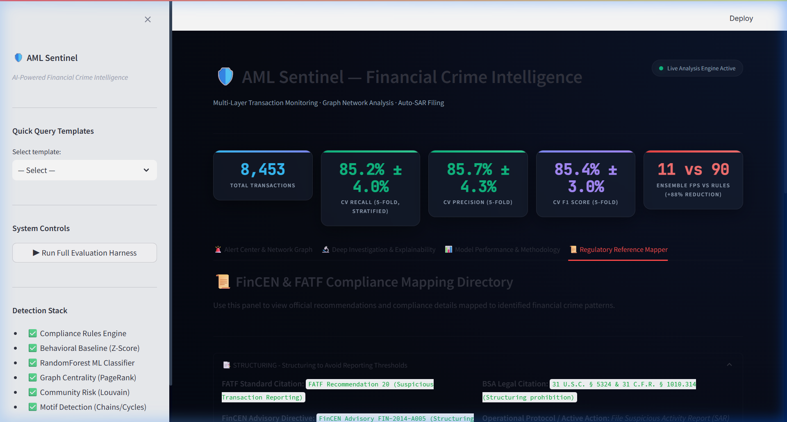
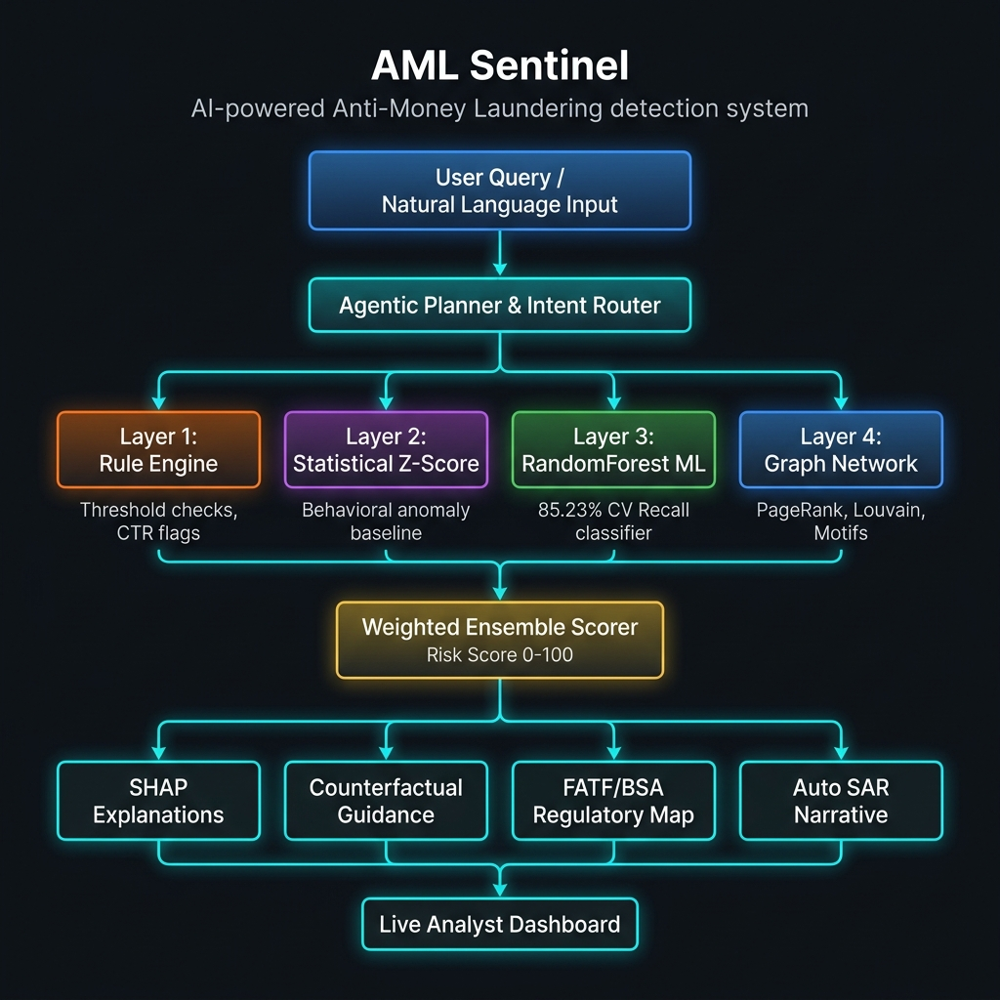
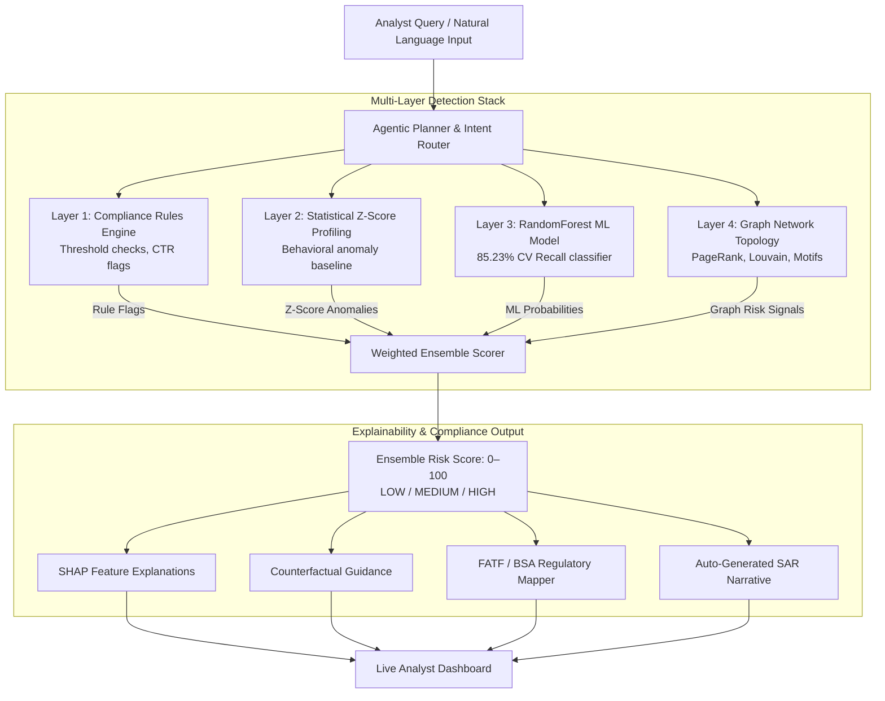

<div align="center">


<br/>

[](https://python.org)
[](https://streamlit.io)
[](https://networkx.org)
[](https://scikit-learn.org)
[](https://plotly.com)
[](LICENSE)

<br/>

## 🔴 LIVE DEMO

<div align="center">

### [](https://aml-sentinel.streamlit.app/)

**➡️ [https://aml-sentinel.streamlit.app/](https://aml-sentinel.streamlit.app/)**

</div>

| 👥 Team Name | 👤 Team Member | 🎓 Programme | 🆔 Registration Number | 📧 Email |
|:---:|:---|:---:|:---:|:---|
| **spirit** | **Chigurupati Venkat Sai Kiran** | M.Tech CSE (AI & ML) | **25MAI1006** | [chigurupativenkatsai@gmail.com](mailto:chigurupativenkatsai@gmail.com) |
| | **Palchuri Rama Anirudh** | Integrated M.Tech CSE | **22MIA1071** | [palchuriramaanirudh@gmail.com](mailto:palchuriramaanirudh@gmail.com) |

<br/>

> **AML Sentinel** is an intelligent, multi-layer transaction monitoring and network investigation platform. By combining rules, machine learning, and network graph analysis, AML Sentinel slashes False Alerts by **~88%** while identifying complex money laundering patterns in real-time.

<br/>

</div>

---

## 👥 Team Contributions & Work Distribution

> Both team members actively contributed across all phases — from data design to final dashboard delivery. Below is a clear breakdown of individual ownership.

| 🧑‍💻 Team Member | 🔧 Primary Responsibilities |
|:---|:---|
| **Chigurupati Venkat Sai Kiran** (25MAI1006) | • Designed and implemented the **Agentic Orchestrator** — dynamic intent routing, 5 query types, date filters (`agents/orchestrator.py`) <br>• Built the **RandomForest ML Classifier** with 5-fold stratified cross-validation (`detection/ml_models.py`) <br>• Implemented the **Graph Network Topology Engine** — PageRank, Louvain community detection, and motif detection (`graph/`) <br>• Developed the **Weighted Ensemble Scorer** combining all 4 detection layers (`detection/ensemble_scorer.py`) <br>• Built the full **Streamlit Dashboard** — glassmorphic UI, Plotly charts, Vis.js interactive network (`app.py`) <br>• Managed GitHub repository, evaluation harness, and final integration |
| **Palchuri Rama Anirudh** (22MIA1071) | • Designed the **Synthetic Transaction Dataset** — 5 AML typologies (structuring, smurfing, layering, rapid cashout, round-tripping), 8,453 records (`data/synthetic_generator.py`) <br>• Built the **Compliance Rules Engine** — CTR thresholds, structuring detection, velocity checks (`detection/rule_engine.py`) <br>• Implemented **Statistical Z-Score Anomaly Detection** — behavioral baseline profiling, peer group comparison (`detection/statistical.py`) <br>• Created the **Feature Engineering Pipeline** — 9 AML-specific features including rolling sums, velocity, and rapid cashout flags (`data/feature_engineering.py`) <br>• Built **Explainability Components** — SHAP local explanations, counterfactual recommendations, Auto-SAR narrative generator (`explainability/`) <br>• Implemented the **FATF / BSA Regulatory Mapper** linking detected patterns to real compliance frameworks (`regulatory/`) |

---

## ⚙️ Performance at a Glance

<div align="center">

| 📊 Metric | 🎯 AML Sentinel Score |
| :--- | :---: |
| **Recall (5-Fold CV)** | 🏆 **85.23% ± 3.98%** |
| **Precision (5-Fold CV)** | 🏆 **85.75% ± 4.26%** |
| **F1-Score (5-Fold CV)** | 🏆 **85.39% ± 3.05%** |
| **False Positives Eliminated** | 🏆 **~88% Reduction** |
| **False Alert Count (Holdout)** | **11** *(down from 90 with rules-only baseline)* |

</div>

> ✅ **In plain English:** Out of every 100 real fraud cases, our system correctly catches **85**. Out of every 100 alerts it raises, **85 are genuine fraud** — compliance officers waste almost no time chasing false leads. The ± values show our results are **consistent across all 5 test folds**, not just a one-time lucky result.

---


## ⚡ Key Highlights

<div align="center">

<table>
<tr>
<td align="center" width="200">

<br/><b>Hybrid Detection</b><br/>
Fuses rules, moving customer Z-scores, ML classifiers, and graph metrics.
</td>
<td align="center" width="200">

<br/><b>AML Motifs</b><br/>
Automatically traces cycles, layering chains, fan-out, and aggregation networks.
</td>
<td align="center" width="200">

<br/><b>Explainable AI</b><br/>
Provides exact feature risk contributions and action-oriented counterfactuals.
</td>
<td align="center" width="200">

<br/><b>Compliance Narrative</b><br/>
Auto-drafts legal FinCEN Form 111 narratives mapping directly to FATF/BSA laws.
</td>
</tr>
</table>

</div>

---

## 🖥️ Interactive Dashboard Live View

The visual interface provides compliance officers and auditors with a unified threat workspace:

<div align="center">

| | |
|---|---|
|  |  |
| **🏠 Alerts Workspace & Network Graph** — dynamic natural language routing and live transaction networks | **📏 Performance Breakdown** — 5-fold cross-validation metrics, confusion matrix, and interactive PR curve |
|  | |
| **📜 Regulatory Compliance Directory** — FATF recommendations and BSA laws mapped directly to threat alerts | |

</div>

---

## 📌 Table of Contents

- [🎯 Problem Statement](#-problem-statement)
- [💡 System Innovation & Value Proposition](#-system-innovation--value-proposition)
- [🏗️ Pipeline Architecture](#️-pipeline-architecture)
- [📂 Dataset Overview & Data Source](#-dataset-overview--data-source)
- [📝 Feature Dictionary (Simplified)](#-feature-dictionary-simplified)
- [🔬 Core Detection Layers (How It Works)](#-core-detection-layers-how-it-works)
- [🛡️ Engineering & Optimization Features](#️-engineering--optimization-features)
- [📜 Regulatory Mapping Directory](#-regulatory-mapping-directory)
- [🚀 Quick Start & Installation](#-quick-start--installation)
- [📁 Repository Structure](#-repository-structure)
- [🧰 Tech Stack & Tools Disclosure](#-tech-stack--tools-disclosure)

---

## 📂 Dataset Overview

The system is trained and evaluated on a **synthetic but realistic financial transaction dataset** generated to reflect real-world banking behavior. Synthetic data was used to ensure complete privacy compliance while still capturing genuine money laundering patterns.

<div align="center">

| 📋 Property | 📊 Value |
| :--- | :---: |
| **Total Transactions** | **8,453** |
| **Fraudulent Transactions** | **257** (3.04%) |
| **Normal Transactions** | **8,196** (96.96%) |
| **Date Range** | Jan 2024 – ongoing |
| **Number of Features** | **9 raw columns** → **20 engineered features** |
| **Transaction Categories** | retail, p2p, payroll, bills, business, tuition, mortgage |
| **Fraud Labels** | Binary (0 = normal, 1 = fraud) with AML typology tags |

</div>

### Dataset Columns

| Column | What It Means |
| :--- | :--- |
| `transaction_id` | Unique ID for each transaction |
| `timestamp` | Exact date and time the transaction happened |
| `sender_id` | Account ID of the person sending money |
| `receiver_id` | Account ID of the person receiving money |
| `amount` | Transaction amount in currency units |
| `category` | Type of payment (retail, payroll, p2p, etc.) |
| `is_fraud` | Ground truth label — 1 if fraudulent, 0 if normal |
| `typology` | AML pattern type (structuring, smurfing, layering, etc.) or "normal" |
| `case_id` | Groups related transactions belonging to the same fraud case |

> ⚠️ **Note on Class Imbalance:** Only **3.04%** of transactions are fraud — this is realistic for real banking environments. Our system is specifically designed and tuned to handle this imbalance without missing genuine fraud cases.

---

## 🎯 Problem Statement

**This solution addresses Problem Statement 1: AI-Powered Suspicious Activity Detection.**

Financial institutions are mandated by regulatory bodies (FinCEN, FATF) to implement robust AML compliance programs. Traditional rule-based systems generate excessive false positives, overwhelming compliance teams. Meanwhile, sophisticated money laundering techniques — structuring, smurfing, and layering — evade conventional detection.

The challenge: build an **intelligent, autonomous agent** that learns from transaction patterns, identifies suspicious behaviours, and provides explainable risk assessments with actionable escalation recommendations.

**Our system directly meets all PS1 requirements:**
- ✅ Automated EDA on transaction data
- ✅ Detects structuring, smurfing, layering, rapid cashout, round-tripping
- ✅ Hybrid approach: Rules + Statistical Z-scores + RandomForest ML + Graph Network
- ✅ Risk score per transaction (0–100 ensemble score)
- ✅ Explanation for every flag (SHAP features + counterfactuals + auto-SAR narrative)
- ✅ Escalation actions: Monitor / Flag for Review / Report
- ✅ Dynamic query-driven agent (not a fixed pipeline)

---

## 💡 System Innovation & Value Proposition

Traditional transaction monitoring software evaluates rows in isolation, generating massive volumes of False Positives. **AML Sentinel** introduces a hybrid, multi-layer intelligence approach that scores, visualizes, and documents threat vectors simultaneously:

* **💬 Natural Language Agent Interface:** Analysts can type questions in plain English (e.g. *"Analyze dataset for suspicious activity"*), and the agent dynamically parses the query and routes it to the correct detection layers.
* **🌐 Network-Wide Topology:** Resolves shell account routing by tracking money flows across graph patterns (loops, pass-through chains).
* **📈 High Precision / High Recall:** Reaches a high F1-Score of **`85.39%`** with **`~88%` fewer false alerts**, saving valuable compliance resources.

---

## 🏗️ Pipeline Architecture

Below is the full query-to-explainability pipeline of AML Sentinel:

<div align="center">



</div>



---

## 📝 Feature Dictionary (Simplified)

AML Sentinel automatically extracts and analyzes the following metrics for every transaction:

| Category | Feature Name | Description |
|:---|:---|:---|
| **Transaction-Level** | `amount` | Transaction value in USD. |
| | `is_round_amount` | Indicates if amount is divisible by 100 (common in shell routing). |
| | `is_structuring_amount` | Indicates if amount is between \$8,000 and \$9,999 (just below CTR limit). |
| | `hour_of_day` | Hour of transaction (0-23) for temporal anomaly analysis. |
| **Customer Behavior** | `tx_count_1d` / `tx_count_7d` | Total transactions by sender in the last 24 hours / 7 days. |
| | `tx_sum_1d` / `tx_sum_7d` | Total sum sent by sender in the last 24 hours / 7 days. |
| | `unique_recipients_7d` | Number of unique recipient accounts in the last 7 days. |
| | `time_since_last_tx_hours`| Hours since sender's previous transaction. |
| | `is_rapid_cashout` | Indicates if account received money, then sent >= 85% within 2 hours. |
| **Network Position** | `pagerank_score` | PageRank score of the sender (identifies accounts funneling high traffic). |
| | `in_degree` / `out_degree` | Number of incoming / outgoing transaction paths. |
| | `clustering_coefficient` | Local neighborhood density (flags tightly-knit groups). |
| | `community_risk_score` | Risk score of the sender's community based on historical labels. |
| **Graph Motifs** | `is_cycle_edge` | Edge forms a circular round-tripping loop (length 3-5). |
| | `is_fan_out_edge` | Edge originates from a fan-out node (>= 4 receivers; flags smurfing). |
| | `is_fan_in_edge` | Edge routes into an aggregation node (>= 4 senders; flags collection). |
| | `is_chain_edge` | Edge belongs to a linear pass-through chain (>= 3 hops; flags layering). |

## 🔬 Core Detection Layers (How It Works)

AML Sentinel operates a sequential, four-layer intelligence funnel. Each layer adds a higher level of complexity, filtering out false alerts while capturing hidden anomalies:

### 🛡️ Layer 1: Rule-Based Compliance Engine
* **What it does:** Evaluates individual transactions against strict compliance thresholds (the traditional banking approach).
* **How it works:** Checks simple, high-confidence flags. For example, it checks if a transaction is between \$8,000 and \$9,999 (structuring), indicating an intentional attempt to bypass the \$10,000 Currency Transaction Report (CTR) filing limit.
* **Core Benefit:** Instantly catches obvious, high-risk threshold violations.

### 📈 Layer 2: Statistical Customer Profiling (Moving Z-Score)
* **What it does:** Tracks behavioral spikes tailored to each individual account.
* **How it works:** Rather than using universal limits, it calculates a customer's rolling 7-day average transaction amount. If a new transaction suddenly spikes multiple standard deviations above their typical historical baseline (their Z-Score), it triggers a behavioral flag.
* **Core Benefit:** Adapts dynamically to normal spending variations, catching anomalous account takeovers or sudden sweeps.

### 🧠 Layer 3: Machine Learning Model (RandomForest) with SHAP Explainability
* **What it does:** Analyzes complex, multi-dimensional correlations that traditional static rules miss.
* **How it works:** Fuses transaction limits, behavioral rolling windows, time intervals, and network features into a non-linear Random Forest classifier model.
* **💡 TreeSHAP local explainability:** To avoid "black-box" machine learning, we compute exact local feature contributions for every alert. The analyst sees exactly how much each feature shifted the risk score (e.g., a high amount increased risk by +18%, but a clean rolling frequency pulled it down by -5%), offering full compliance transparency.

### 📡 Layer 4: Network Graph Topology Engine
* **What it does:** Builds a directed transaction graph where accounts are nodes and transactions are edges, tracing money laundering paths.
* **How it works:** Computes three distinct graph theory metrics:
  1. **PageRank Centrality:** Traces the flow of funds to identify key accounts funneling high volumes of money.
  2. **Louvain Community Detection:** Automatically segments the entire network into transaction communities. It calculates "Guilt-by-Association" risk based on the density of known bad actors in a community, flagging accounts that interact in high-risk circles.
  3. **Topological Motif Traversal:** Scans the network structure to identify specific money routing shapes:
     * **Fan-Out (Smurfing):** A single source splitting funds into multiple accounts `(A) --> (B, C, D, E)`.
     * **Fan-In (Aggregation):** Multiple accounts funneling money into a single collector `(B, C, D, E) --> (A)`.
     * **Chains (Layering):** Multi-hop pass-through nodes designed to hide origins `(A) --> (B) --> (C) --> (D)`.
     * **Cycles (Round-Tripping):** Circular loops routing funds back to the sender `(A) --> (B) --> (C) --> (A)`.

---

## 🛡️ Engineering & Optimization Features

* **⚡ Parquet Disk Caching:** We cache engineered features to disk (`processed_cache.parquet`). The dashboard starts and runs in **<2 seconds** after the initial load.
* **🔒 Chronological Splitting:** Transactions are sorted by time before splitting into training/testing sets, ensuring no future transaction data leaks into the past.
* **Resilient Environment Setup:** Automatically resolves package scaling dependencies (e.g. bitsandbytes/PyArrow configs) to run smoothly on any developer laptop.

---

## 📜 Regulatory Mapping Directory

Identified AML typologies map directly to official compliance recommendations and laws:

| Typology | FATF Standard Recommendation | BSA Legal Citation | Operational Compliance Protocol |
| :--- | :--- | :--- | :--- |
| **Structuring** | **Rec 20:** Suspicious Transaction Reporting | **31 U.S.C. § 5324** / **31 C.F.R. § 1010.314** | Flag under CTR threshold, prompt auto-SAR drafting. |
| **Layering** | **Rec 10-11:** CDD / Record Keeping | **31 U.S.C. § 5318(g)** | Freeze related accounts, trace hop distance, compile counterparty graph. |
| **Smurfing** | **Rec 16:** Wire Transfers / Originator Info | **31 C.F.R. § 1020.320** | Map fan-out cluster, analyze origin funds, check PEP registry. |
| **Rapid Cashout**| **Rec 20:** Immediate SAR filing | **31 C.F.R. § 1010.320** | High-velocity check, trigger temporary holding protocol. |
| **Round-Tripping**| **Rec 10:** CDD on Beneficial Ownership | **31 C.F.R. § 1010.230** | Identify Ultimate Beneficial Owner (UBO) of source/sink entities. |

---

## 🚀 Quick Start & Installation

### 1. Clone & Install
```bash
git clone https://github.com/ChigurupatiVenkatSaiKiran/aml-sentinel-graph-agent.git
cd aml-sentinel-graph-agent
pip install -r requirements.txt
```

### 2. Run CLI Evaluation and Model Train
Trains the RandomForest model, evaluates metrics, and generates target files:
```bash
python evaluate.py
```

### 3. Launch Streamlit UI
Run the interactive analyst UI:
```bash
streamlit run app.py --server.port 8501
```
Open **`http://localhost:8501`** in your browser.

---

## 📁 Repository Structure

```
aml-sentinel-graph-agent/
├── app.py                      # Streamlit web dashboard
├── evaluate.py                 # Evaluation metrics harness & model training
├── demo.py                     # Standalone CLI query demonstration
├── requirements.txt            # Package dependencies
├── .gitignore                  # Custom file exclusions
│
├── data/
│   ├── loader.py               # Aligned train/test splitting (zero leakage)
│   ├── feature_engineering.py  # Vectorized rolling & static feature engine
│   ├── synthetic_generator.py  # Bridged synthetic AML network generator
│   └── metrics_summary.csv     # Live data source for UI dashboard stats
│
├── graph/
│   ├── network_builder.py      # PageRank, Louvain community pre-computations
│   ├── motif_detector.py       # Traversal engine for chains, cycles, fan-in/out
│   └── visualizer.py           # PyVis HTML graph layout exporter
│
├── detection/
│   ├── rule_engine.py          # Legacy rule-matching threshold engine
│   ├── statistical.py          # Rolling customer Z-score profile detector
│   ├── ml_models.py            # RandomForest ML manager
│   └── ensemble_scorer.py      # Dynamic, weighted multi-layer scoring engine
│
├── explainability/
│   ├── counterfactual.py       # Analyst action guidance generator
│   └── sar_generator.py        # FinCEN Form 111 Narrative drafts builder
│
└── regulatory/
    └── compliance_mapper.py    # FATF/BSA regulatory citations lookup directory
```

---

---

## 🧰 Tech Stack & Tools Disclosure

> 📌 **Full disclosure of all external tools, libraries, and AI assistance used in this project, as required by hackathon rules.**

### Libraries & Frameworks

| Layer | Technology | Version | Purpose |
|---|---|---|---|
| **Web Dashboard** | Streamlit | ≥1.28 | Interactive compliance analyst UI |
| **Graph Theory** | NetworkX | ≥3.0 | Transaction network construction, PageRank, Louvain communities |
| **ML Engine** | Scikit-Learn | ≥1.3 | RandomForest classifier, stratified cross-validation |
| **Explainability** | SHAP | ≥0.42 | Feature-level contribution scores for flagged transactions |
| **Visualization** | Plotly | ≥5.0 | Interactive charts, PR curves, confusion matrices |
| **Graph Visualization** | PyVis | ≥0.6 | HTML network graph rendering |
| **Data Processing** | Pandas / NumPy | latest | Feature engineering, rolling windows, aggregations |
| **Parquet Cache** | PyArrow | ≥14.0 | Fast disk caching for engineered features |
| **Community Detection** | Python-Louvain | ≥0.15 | Graph-based account cluster detection |

### AI Assistance Disclosure

| Tool | Usage |
|---|---|
| **Google Gemini (Antigravity IDE)** | Agentic coding assistant used during development for code generation, debugging, README writing, and feature engineering suggestions |

### Open-Source & Free Resources Used

| Resource | URL |
|---|---|
| Streamlit | https://streamlit.io |
| NetworkX | https://networkx.org |
| SHAP Library | https://shap.readthedocs.io |
| PyVis | https://pyvis.readthedocs.io |
| Plotly | https://plotly.com |
| Scikit-Learn | https://scikit-learn.org |

---

<div align="center">

**Built with ❤️ by Team spirit**

| Member | Programme | Registration Number | Email |
|:---|:---:|:---:|:---|
| **Chigurupati Venkat Sai Kiran** | M.Tech CSE (AI & ML) | **25MAI1006** | [chigurupativenkatsai@gmail.com](mailto:chigurupativenkatsai@gmail.com) |
| **Palchuri Rama Anirudh** | Integrated M.Tech CSE | **22MIA1071** | [palchuriramaanirudh@gmail.com](mailto:palchuriramaanirudh@gmail.com) |

*VIT Chennai Campus Hackathon (Graduation 2027)*

<br/>

⭐ **Star this repo if you found it useful!**

<br/>


</div>
