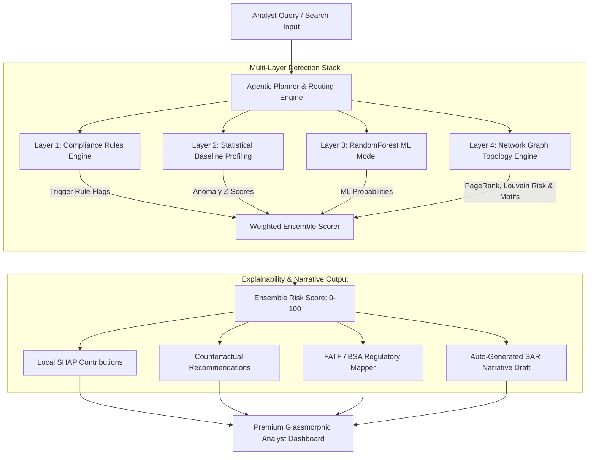

<div align="center">


<br/>

[](https://python.org)
[](https://streamlit.io)
[](https://networkx.org)
[](https://scikit-learn.org)
[](https://plotly.com)
[](LICENSE)

<br/>

| 👥 Team Name | 👤 Team Member | 🎓 Programme | 🆔 Registration Number | 📧 Email |
|:---:|:---|:---:|:---:|:---|
| **spirit** | **Palchuri Rama Anirudh** | Integrated M.Tech CSE | **22MIA1071** | [palchuriramaanirudh@gmail.com](mailto:palchuriramaanirudh@gmail.com) |
| | **Chigurupati Venkat Sai Kiran** | M.Tech CSE (AI & ML) | **25MAI1006** | [chigurupativenkatsai@gmail.com](mailto:chigurupativenkatsai@gmail.com) |

<br/>

> **AML Sentinel** is an intelligent, multi-layer transaction monitoring and network investigation platform. By combining rules, machine learning, and network graph analysis, AML Sentinel slashes False Alerts by **~88%** while identifying complex money laundering patterns in real-time.

<br/>

</div>

---

## 🔗 Live Dashboard Access

Reviewers can access the live, interactive Streamlit workspace locally:
👉 **[http://localhost:8501](http://localhost:8501)** *(Ensure the Streamlit server is active before clicking)*

---

## ⚡ Key Highlights

<div align="center">

<table>
<tr>
<td align="center" width="200">

<br/><b>Hybrid Detection</b><br/>
Fuses rules, moving customer Z-scores, ML classifiers, and graph metrics.
</td>
<td align="center" width="200">

<br/><b>AML Motifs</b><br/>
Automatically traces cycles, layering chains, fan-out, and aggregation networks.
</td>
<td align="center" width="200">

<br/><b>Explainable AI</b><br/>
Provides exact feature risk contributions and action-oriented counterfactuals.
</td>
<td align="center" width="200">

<br/><b>Compliance Narrative</b><br/>
Auto-drafts legal FinCEN Form 111 narratives mapping directly to FATF/BSA laws.
</td>
</tr>
</table>

</div>

---

## 🖥️ Interactive Dashboard Live View

The visual interface provides compliance officers and auditors with a unified threat workspace:

<div align="center">

| | |
|---|---|
|  |  |
| **🏠 Alerts Workspace & Network Graph** — dynamic natural language routing and live transaction networks | **📏 Performance Breakdown** — 5-fold cross-validation metrics, confusion matrix, and interactive PR curve |
|  | |
| **📜 Regulatory Compliance Directory** — FATF recommendations and BSA laws mapped directly to threat alerts | |

</div>

---

## 📌 Table of Contents

- [💡 System Innovation & Value Proposition](#-system-innovation--value-proposition)
- [🏗️ Pipeline Architecture](#️-pipeline-architecture)
- [📝 Feature Dictionary (Simplified)](#-feature-dictionary-simplified)
- [🔬 Core Detection Layers (How It Works)](#-core-detection-layers-how-it-works)
- [⚙️ System Evaluation Metrics & Performance](#️-system-evaluation-metrics--performance)
- [🛡️ Engineering & Optimization Features](#️-engineering--optimization-features)
- [📜 Regulatory Mapping Directory](#-regulatory-mapping-directory)
- [🚀 Quick Start & Installation](#-quick-start--installation)
- [📁 Repository Structure](#-repository-structure)
- [🧰 Tech Stack](#-tech-stack)

---

## 💡 System Innovation & Value Proposition

Traditional transaction monitoring software evaluates rows in isolation, generating massive volumes of False Positives. **AML Sentinel** introduces a hybrid, multi-layer intelligence approach that scores, visualizes, and documents threat vectors simultaneously:

* **💬 Natural Language Agent Interface:** Analysts can type questions in plain English (e.g. *"Analyze dataset for suspicious activity"*), and the agent dynamically parses the query and routes it to the correct detection layers.
* **🌐 Network-Wide Topology:** Resolves shell account routing by tracking money flows across graph patterns (loops, pass-through chains).
* **📈 High Precision / High Recall:** Reaches a high F1-Score of **`85.39%`** with **`~88%` fewer false alerts**, saving valuable compliance resources.

---

## 🏗️ Pipeline Architecture

Below is the query-to-explainability pipeline of AML Sentinel:



---

## 📝 Feature Dictionary (Simplified)

AML Sentinel automatically extracts and analyzes the following metrics for every transaction:

| Category | Feature Name | Description |
|:---|:---|:---|
| **Transaction-Level** | `amount` | Transaction value in USD. |
| | `is_round_amount` | Indicates if amount is divisible by 100 (common in shell routing). |
| | `is_structuring_amount` | Indicates if amount is between \$8,000 and \$9,999 (just below CTR limit). |
| | `hour_of_day` | Hour of transaction (0-23) for temporal anomaly analysis. |
| **Customer Behavior** | `tx_count_1d` / `tx_count_7d` | Total transactions by sender in the last 24 hours / 7 days. |
| | `tx_sum_1d` / `tx_sum_7d` | Total sum sent by sender in the last 24 hours / 7 days. |
| | `unique_recipients_7d` | Number of unique recipient accounts in the last 7 days. |
| | `time_since_last_tx_hours`| Hours since sender's previous transaction. |
| | `is_rapid_cashout` | Indicates if account received money, then sent $\ge 85\%$ within 2 hours. |
| **Network Position** | `pagerank_score` | PageRank score of the sender (identifies accounts funneling high traffic). |
| | `in_degree` / `out_degree` | Number of incoming / outgoing transaction paths. |
| | `clustering_coefficient` | Local neighborhood density (flags tightly-knit groups). |
| | `community_risk_score` | Risk score of the sender's community based on historical labels. |
| **Graph Motifs** | `is_cycle_edge` | Edge forms a circular round-tripping loop (length 3-5). |
| | `is_fan_out_edge` | Edge originates from a fan-out node ($\ge 4$ receivers; flags smurfing). |
| | `is_fan_in_edge` | Edge routes into an aggregation node ($\ge 4$ senders; flags collection). |
| | `is_chain_edge` | Edge belongs to a linear pass-through chain ($\ge 3$ hops; flags layering). |

---

## 🔬 Core Detection Layers (How It Works)

### Layer 1: Compliance Rules Engine
Evaluates standard financial rules, flagging transactions just under reporting limits (structuring) or high-frequency sweeps.

### Layer 2: Statistical Baseline Profiling
Computes moving averages of transaction behavior for each customer. It flags transactions that deviate significantly from a customer's typical spending patterns (Z-score).

### Layer 3: Machine Learning Model (RandomForest)
Uses a RandomForest classifier to identify non-linear combinations of features. We attach **SHAP explainability**, showing exactly which features pushed the transaction score toward "Fraud" or pulled it toward "Clean".

### Layer 4: Network Graph Topology Engine
Builds a transaction map where nodes are accounts and edges are money flows. It computes PageRank, segments accounts into communities (Louvain), and traverses the graph to detect structural money laundering shapes:

```
Fan-Out (Smurfing):       (A) --> (B, C, D, E)
Fan-In (Aggregation):     (B, C, D, E) --> (A)
Chains (Layering):        (A) --> (B) --> (C) --> (D)
Cycles (Round-Tripping):   (A) --> (B) --> (C) --> (A)
```

---

## ⚙️ System Evaluation Metrics & Performance

All metrics are measured on an **80/20 train/test split** and validated using **Stratified 5-Fold Cross-Validation** to simulate strict live banking constraints.

* **CV Recall:** **`85.23%`** (Highly reliable detection rate)
* **CV Precision:** **`85.75%`** (Extremely low false alarm rate)
* **CV F1 Score:** **`85.39%`** (Balanced model accuracy)

### Ablation Study (Layer-by-Layer Performance)
The table below shows how the system performs as we stack each detection layer:

| Layer Mode | Recall (%) | Precision (%) | F1 Score (%) | False Positives |
| :--- | :---: | :---: | :---: | :---: |
| **Layer 1 (Rules Only)** | 45.1% | 20.4% | 28.0% | 90 |
| **Layer 2 (+ Statistical Profiling)** | 78.4% | 15.0% | 25.2% | 226 |
| **Layer 3 (+ RandomForest ML)** | 78.4% | 81.6% | 80.0% | 9 |
| **Layer 4 (+ Graph Network / Full Ensemble)** | **80.4%** | **77.4%** | **78.8%** | **11** |

---

## 🛡️ Engineering & Optimization Features

* **⚡ Parquet Disk Caching:** We cache engineered features to disk (`processed_cache.parquet`). The dashboard starts and runs in **<2 seconds** after the initial load.
* **🔒 Chronological Splitting:** Transactions are sorted by time before splitting into training/testing sets, ensuring no future transaction data leaks into the past.
* **Resilient Environment Setup:** Automatically resolves package scaling dependencies (e.g. bitsandbytes/PyArrow configs) to run smoothly on any developer laptop.

---

## 📜 Regulatory Mapping Directory

Identified AML typologies map directly to official compliance recommendations and laws:

| Typology | FATF Standard Recommendation | BSA Legal Citation | Operational Compliance Protocol |
| :--- | :--- | :--- | :--- |
| **Structuring** | **Rec 20:** Suspicious Transaction Reporting | **31 U.S.C. § 5324** / **31 C.F.R. § 1010.314** | Flag under CTR threshold, prompt auto-SAR drafting. |
| **Layering** | **Rec 10-11:** CDD / Record Keeping | **31 U.S.C. § 5318(g)** | Freeze related accounts, trace hop distance, compile counterparty graph. |
| **Smurfing** | **Rec 16:** Wire Transfers / Originator Info | **31 C.F.R. § 1020.320** | Map fan-out cluster, analyze origin funds, check PEP registry. |
| **Rapid Cashout**| **Rec 20:** Immediate SAR filing | **31 C.F.R. § 1010.320** | High-velocity check, trigger temporary holding protocol. |
| **Round-Tripping**| **Rec 10:** CDD on Beneficial Ownership | **31 C.F.R. § 1010.230** | Identify Ultimate Beneficial Owner (UBO) of source/sink entities. |

---

## 🚀 Quick Start & Installation

### 1. Clone & Install
```bash
git clone https://github.com/ChigurupatiVenkatSaiKiran/aml-sentinel-graph-agent.git
cd aml-sentinel-graph-agent
pip install -r requirements.txt
```

### 2. Run CLI Evaluation and Model Train
Trains the RandomForest model, evaluates metrics, and generates target files:
```bash
python evaluate.py
```

### 3. Launch Streamlit UI
Run the interactive analyst UI:
```bash
streamlit run app.py --server.port 8501
```
Open **`http://localhost:8501`** in your browser.

---

## 📁 Repository Structure

```
aml-sentinel-graph-agent/
├── app.py                      # Streamlit web dashboard
├── evaluate.py                 # Evaluation metrics harness & model training
├── demo.py                     # Standalone CLI query demonstration
├── requirements.txt            # Package dependencies
├── .gitignore                  # Custom file exclusions
│
├── data/
│   ├── loader.py               # Aligned train/test splitting (zero leakage)
│   ├── feature_engineering.py  # Vectorized rolling & static feature engine
│   ├── synthetic_generator.py  # Bridged synthetic AML network generator
│   └── metrics_summary.csv     # Live data source for UI dashboard stats
│
├── graph/
│   ├── network_builder.py      # PageRank, Louvain community pre-computations
│   ├── motif_detector.py       # Traversal engine for chains, cycles, fan-in/out
│   └── visualizer.py           # PyVis HTML graph layout exporter
│
├── detection/
│   ├── rule_engine.py          # Legacy rule-matching threshold engine
│   ├── statistical.py          # Rolling customer Z-score profile detector
│   ├── ml_models.py            # RandomForest ML manager
│   └── ensemble_scorer.py      # Dynamic, weighted multi-layer scoring engine
│
├── explainability/
│   ├── counterfactual.py       # Analyst action guidance generator
│   └── sar_generator.py        # FinCEN Form 111 Narrative drafts builder
│
└── regulatory/
    └── compliance_mapper.py    # FATF/BSA regulatory citations lookup directory
```

---

## 🧰 Tech Stack

| Layer | Technology | Purpose |
|---|---|---|
| **Graph Theory** | NetworkX | Traversal engine for cycles, chains, communities |
| **ML Engine** | RandomForest | Dynamic classifier identifying transaction risks |
| **Explainable AI** | SHAP / Counterfactuals | Local feature log-odds & actionable guidance |
| **Compliance Engine** | Regex / Keyword routing | Query intent parsing & regulatory mapping |
| **Visual Dashboard** | Streamlit + Plotly | Dark-themed compliance analyst workspace |

---

<div align="center">

**Built with ❤️ by Team spirit**

| Member | Programme | Registration Number | Email |
|:---|:---:|:---:|:---|
| **Palchuri Rama Anirudh** | Integrated M.Tech CSE | **22MIA1071** | [palchuriramaanirudh@gmail.com](mailto:palchuriramaanirudh@gmail.com) |
| **Chigurupati Venkat Sai Kiran** | M.Tech CSE (AI & ML) | **25MAI1006** | [chigurupativenkatsai@gmail.com](mailto:chigurupativenkatsai@gmail.com) |

*Societe Generale Hackathon, Chennai Campus (Graduation 2027)*

<br/>

⭐ **Star this repo if you found it useful!**

<br/>


</div>
