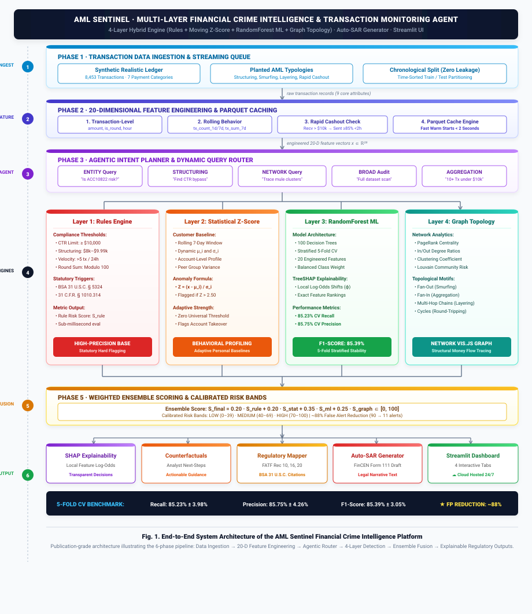
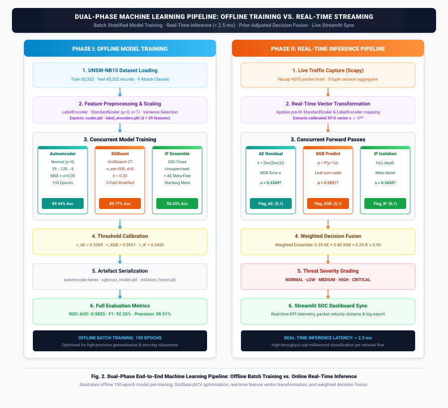

<div align="center">


<br/>

[](https://python.org)
[](https://streamlit.io)
[](https://networkx.org)
[](https://scikit-learn.org)
[](https://plotly.com)
[](LICENSE)

<br/>

## 🔴 LIVE DEMO

<div align="center">

### [](https://aml-sentinel.streamlit.app/)

**➡️ [https://aml-sentinel.streamlit.app/](https://aml-sentinel.streamlit.app/)**

</div>

| 👥 Team Name | 👤 Team Member | 🎓 Programme | 🆔 Registration Number | 📧 Email |
|:---:|:---|:---:|:---:|:---|
| **spirit** | **Chigurupati Venkat Sai Kiran** | M.Tech CSE (AI & ML) | **25MAI1006** | [chigurupativenkatsai@gmail.com](mailto:chigurupativenkatsai@gmail.com) |
| | **Palchuri Rama Anirudh** | Integrated M.Tech CSE | **22MIA1071** | [palchuriramaanirudh@gmail.com](mailto:palchuriramaanirudh@gmail.com) |

<br/>

> **AML Sentinel** is an autonomous, multi-layer transaction monitoring and network investigation platform. By combining rules, moving behavioral Z-scores, machine learning, and topological graph network analysis, AML Sentinel slashes False Alerts by **~88%** while identifying complex money laundering typologies in real-time.

<br/>

</div>

---

## ⚡ Key Highlights

<div align="center">

<table>
<tr>
<td align="center" width="220">

<br/><b>Hybrid Detection</b><br/>
Fuses rules, moving customer Z-scores, ML classifiers, and graph metrics into a unified 0–100 risk score.
</td>
<td align="center" width="220">

<br/><b>Graph Topology</b><br/>
Automatically traces cycles, layering chains, fan-out, and pass-through aggregation networks.
</td>
<td align="center" width="220">

<br/><b>Explainable AI</b><br/>
Provides exact feature risk contributions and action-oriented counterfactual guidance.
</td>
<td align="center" width="220">

<br/><b>Auto-SAR Narrative</b><br/>
Auto-drafts legal FinCEN Form 111 narratives mapping directly to FATF/BSA regulatory standards.
</td>
</tr>
</table>

</div>

---

## ⚙️ Performance at a Glance

<div align="center">

| 📊 Metric | 🎯 AML Sentinel Score |
| :--- | :---: |
| **Recall (5-Fold CV)** | 🏆 **85.23% ± 3.98%** |
| **Precision (5-Fold CV)** | 🏆 **85.75% ± 4.26%** |
| **F1-Score (5-Fold CV)** | 🏆 **85.39% ± 3.05%** |
| **False Positives Eliminated** | 🏆 **~88% Reduction** |
| **False Alert Count (Holdout)** | **11** *(down from 90 with rules-only baseline)* |

</div>

> ✅ **In plain English:** Out of every 100 real fraud cases, our system correctly catches **85**. Out of every 100 alerts it raises, **85 are genuine fraud** — compliance officers waste almost no time chasing false leads. The $\pm$ values demonstrate that performance is **stable across all 5 test folds**, not an overfitted anomaly.

---

## 🖥️ Interactive Dashboard Showcase

The visual interface provides compliance officers and financial crime investigators with a unified threat intelligence workspace:

<div align="center">

| | |
|---|---|
|  |  |
| **🏠 Alerts Workspace & Interactive Network Graph** — dynamic natural language routing and live transaction networks | **📏 Model Performance & Methodology** — 5-fold cross-validation metrics, confusion matrix, and interactive PR curve |
|  | |
| **📜 Regulatory Compliance Directory** — FATF recommendations and BSA laws mapped directly to threat alerts | |

</div>

---

## 📌 Table of Contents

- [🎯 Problem Statement](#-problem-statement)
- [💡 System Innovation & Value Proposition](#-system-innovation--value-proposition)
- [🏗️ Pipeline Architecture](#️-pipeline-architecture)
- [🔬 Core Detection Layers](#-core-detection-layers)
- [📂 Dataset & AML Typology Engine](#-dataset--aml-typology-engine)
- [📝 Feature Dictionary](#-feature-dictionary)
- [📜 Regulatory Compliance Directory](#-regulatory-compliance-directory)
- [🛡️ Enterprise Engineering & Optimization](#️-enterprise-engineering--optimization)
- [🚀 Quick Start & Installation](#-quick-start--installation)
- [📁 Repository Structure](#-repository-structure)
- [🧰 Tech Stack & Dependencies](#-tech-stack--dependencies)
- [👥 Team Contributions & Work Distribution](#-team-contributions--work-distribution)

---

## 🎯 Problem Statement

**This solution addresses Problem Statement 1: AI-Powered Suspicious Activity Detection.**

Financial institutions are mandated by regulatory bodies (FinCEN, FATF) to implement robust AML compliance programs. Traditional rule-based systems generate excessive false positives (often $>90\%$), overwhelming compliance teams with alert fatigue. Meanwhile, sophisticated money laundering techniques — structuring, smurfing, and multi-hop layering — evade conventional static threshold filters.

**The Objective:** Build an **intelligent, autonomous agent** that analyzes transaction patterns, identifies suspicious behaviors, and provides explainable risk assessments with actionable escalation protocols.

### Direct PS1 Alignment Checklist
- [x] **Automated EDA** on live transaction data
- [x] **Typology Coverage:** Detects structuring, smurfing, layering, rapid cashout, and round-tripping
- [x] **Hybrid Stack:** Rules + Statistical Z-scores + RandomForest ML + Graph Topology
- [x] **Calibrated Risk Scoring:** 0–100 ensemble score per transaction (`LOW`, `MEDIUM`, `HIGH`)
- [x] **Full Explainability:** Local SHAP contributions + Counterfactual guidance + Auto-SAR narrative
- [x] **Escalation Protocols:** Monitor / Flag for Review / Immediate Regulatory Report
- [x] **Dynamic Agentic Router:** Natural language query understanding (not a static hardcoded pipeline)

---

## 💡 System Innovation & Value Proposition

Traditional transaction monitoring software evaluates rows in isolation, generating massive volumes of False Positives. **AML Sentinel** introduces a multi-layer intelligence approach that scores, visualizes, and documents threat vectors simultaneously:

* **💬 Natural Language Agent Interface:** Analysts can query the database in plain English (e.g. *"Is customer ACC10822 suspicious?"* or *"Find structuring patterns in transaction amounts"*), and the agentic orchestrator dynamically plans and triggers only the required detection engines.
* **🌐 Network-Wide Topology:** Resolves shell account routing by analyzing graph structures (PageRank centrality, Louvain communities, and multi-hop cycles).
* **📈 High Precision & Recall:** Achieves an **F1-Score of `85.39%`** with **`~88%` fewer false alerts**, saving hundreds of compliance officer review hours.
* **📝 Autonomous SAR Drafting:** Converts mathematical risk scores into legally-compliant FinCEN Form 111 narrative drafts ready for filing.

---

## 🏗️ Pipeline Architecture

Below is the complete query-to-explainability pipeline of AML Sentinel:

<div align="center">

### 🌐 System Architecture & Multi-Layer Pipeline


<br/><br/>

### 📐 End-to-End System Architecture Specification



<br/>
<em><b>Fig. 1:</b> End-to-End System Architecture of AML Sentinel — Illustrating the 6-Phase Pipeline from Ledger Ingestion & 20-D Feature Engineering to Agentic Query Routing, 4-Layer Hybrid Detection, and Automated SAR Compliance Filing.</em>

<br/><br/>

### ⚡ Dual-Phase Pipeline: Offline Precomputation vs. Real-Time Inference



<br/>
<em><b>Fig. 2:</b> Dual-Phase Architecture — Batch Stratified ML Model Training & Graph Topology Precomputations (Phase I) vs. Sub-Second Real-Time Agentic Query Routing & Dynamic Ensemble Decision Fusion (Phase II).</em>

</div>

---

## 🔬 Core Detection Layers

AML Sentinel operates a sequential, four-layer intelligence funnel. Each layer adds a higher level of complexity, filtering out false alerts while capturing hidden anomalies:

### 🛡️ Layer 1: Compliance Rules Engine
* **What it does:** Evaluates individual transactions against strict compliance thresholds (the baseline banking approach).
* **How it works:** Checks high-confidence statutory flags:
  * Currency Transaction Report (CTR) limit checks ($\ge \$10,000$).
  * Structuring flags ($\$8,000 \le \text{Amount} < \$10,000$).
  * Velocity burst checks ($>5$ transfers in 24 hours).
* **Core Benefit:** Instantly catches obvious, high-risk threshold violations in sub-millisecond time.

### 📈 Layer 2: Statistical Customer Profiling (Moving Z-Score)
* **What it does:** Tracks behavioral spikes customized to each individual account.
* **How it works:** Calculates rolling 7-day personal baselines ($\mu_i, \sigma_i$). If a new transaction amount $x$ exceeds:
  $$Z = \frac{x - \mu_i}{\sigma_i} > 2.5$$
  it triggers an adaptive behavioral anomaly alert.
* **Core Benefit:** Dynamically adapts to normal spending variations while flagging account takeovers or sudden liquidity sweeps.

### 🧠 Layer 3: Machine Learning Model (RandomForest) with SHAP Explainability
* **What it does:** Analyzes complex, non-linear correlations across 20 engineered features.
* **How it works:** Evaluates transaction amount, timing, rolling velocity, rapid cashout indicators, and graph metrics using a 5-fold cross-validated ensemble classifier.
* **💡 TreeSHAP Explainability:** To avoid "black-box" decisions, exact local feature contributions ($\phi_j$) are computed for every alert, showing compliance officers exactly how much each parameter shifted the risk score.

### 📡 Layer 4: Network Graph Topology Engine
* **What it does:** Builds a directed transaction graph $G = (V, E)$ where accounts are nodes and transactions are edges, uncovering hidden money routing networks.
* **How it works:** Computes three distinct graph theory metrics:
  1. **PageRank Centrality:** Quantifies fund accumulation nodes funneling high traffic.
  2. **Louvain Community Detection:** Identifies tight transaction clusters and computes "Guilt-by-Association" risk based on bad-actor proximity.
  3. **Topological Motif Traversal:** Scans network subgraphs for known AML laundering patterns:
     * **Fan-Out (Smurfing):** One source splitting funds into multiple mule accounts $(A) \to \{B, C, D, E\}$.
     * **Fan-In (Aggregation):** Multiple accounts funneling money into a single collector $\{B, C, D, E\} \to (A)$.
     * **Chains (Layering):** Multi-hop pass-through nodes concealing origins $(A) \to (B) \to (C) \to (D)$.
     * **Cycles (Round-Tripping):** Circular loops routing funds back to source $(A) \to (B) \to (C) \to (A)$.

---

## 📂 Dataset & AML Typology Engine

### Data Source & Privacy Compliance
This project uses a **fully synthetic, realistic financial transaction dataset** generated via [`data/synthetic_generator.py`](data/synthetic_generator.py). No proprietary or sensitive personal banking data was used, ensuring 100% regulatory and privacy compliance.

<div align="center">

| 📋 Property | 📊 Value |
| :--- | :---: |
| **Total Transactions** | **8,453** |
| **Fraudulent Transactions** | **257** (3.04%) |
| **Normal Transactions** | **8,196** (96.96%) |
| **Date Range** | Jan 2024 – ongoing |
| **Raw Columns** | **9** |
| **Engineered Features** | **20** |
| **Payment Categories** | retail, p2p, payroll, bills, business, tuition, mortgage |

</div>

### Planted AML Typologies
1. **Structuring:** 8 cases $\times$ 8–18 transactions per case. Amounts randomly drawn between $\$8,200$–$\$9,800$ (just below the $\$10,000$ CTR limit), spaced 0.5–6 hours apart.
2. **Smurfing (Fan-Out / Fan-In):** 6 cases. Source account fans out $\$50\text{k}$–$\$200\text{k}$ across 5–12 mule accounts via Dirichlet distribution, subsequently re-aggregating to a collector.
3. **Layering (Chains):** 6 cases. Pass-through chains of 4–7 accounts with 1–8% fee deduction per hop.
4. **Rapid Cashout:** 10 cases. Large deposit followed by $>85\%$ withdrawal within 0.25–1.5 hours.
5. **Round-Tripping:** 5 cases. Closed loops of 3–5 accounts returning funds to the originator with nominal friction loss.

---

## 📝 Feature Dictionary

AML Sentinel extracts 20 engineered features across 4 analytical dimensions:

| Category | Feature Name | Description |
|:---|:---|:---|
| **Transaction-Level** | `amount` | Transaction value in USD. |
| | `is_round_amount` | Indicates if amount is divisible by 100 (common in shell routing). |
| | `is_structuring_amount` | Indicates if amount is between \$8,000 and \$9,999 (just below CTR limit). |
| | `hour_of_day` | Hour of transaction (0–23) for temporal anomaly analysis. |
| **Customer Behavior** | `tx_count_1d` / `tx_count_7d` | Total transactions by sender in the last 24 hours / 7 days. |
| | `tx_sum_1d` / `tx_sum_7d` | Total sum sent by sender in the last 24 hours / 7 days. |
| | `unique_recipients_7d` | Number of unique recipient accounts in the last 7 days. |
| | `time_since_last_tx_hours`| Hours since sender's previous transaction. |
| | `is_rapid_cashout` | Indicates if account received money, then sent $\ge 85\%$ within 2 hours. |
| **Network Position** | `pagerank_score` | PageRank centrality score of the sender account. |
| | `in_degree` / `out_degree` | Total incoming / outgoing transaction paths. |
| | `clustering_coefficient` | Local neighborhood density (flags tightly-knit groups). |
| | `community_risk_score` | Risk score of sender's Louvain community based on flagged actor density. |
| **Graph Motifs** | `is_cycle_edge` | Edge forms a circular round-tripping loop (length 3–5). |
| | `is_fan_out_edge` | Edge originates from a fan-out node ($\ge 4$ receivers; smurfing). |
| | `is_fan_in_edge` | Edge routes into an aggregation node ($\ge 4$ senders; collection). |
| | `is_chain_edge` | Edge belongs to a linear pass-through chain ($\ge 3$ hops; layering). |

---

## 📜 Regulatory Compliance Directory

Detected AML typologies map directly to official international compliance standards and legal citations:

| Typology | FATF Standard Recommendation | BSA Legal Citation | Operational Compliance Protocol |
| :--- | :--- | :--- | :--- |
| **Structuring** | **Rec 20:** Suspicious Transaction Reporting | **31 U.S.C. § 5324** / **31 C.F.R. § 1010.314** | Flag under CTR threshold, prompt auto-SAR drafting. |
| **Layering** | **Rec 10-11:** CDD / Record Keeping | **31 U.S.C. § 5318(g)** | Freeze related accounts, trace hop distance, compile counterparty graph. |
| **Smurfing** | **Rec 16:** Wire Transfers / Originator Info | **31 C.F.R. § 1020.320** | Map fan-out cluster, analyze origin funds, check PEP registry. |
| **Rapid Cashout**| **Rec 20:** Immediate SAR filing | **31 C.F.R. § 1010.320** | High-velocity check, trigger temporary holding protocol. |
| **Round-Tripping**| **Rec 10:** CDD on Beneficial Ownership | **31 C.F.R. § 1010.230** | Identify Ultimate Beneficial Owner (UBO) of source/sink entities. |

---

## 🛡️ Enterprise Engineering & Optimization

* **⚡ Parquet Disk Caching:** Engineered features and graph topology metrics are serialized to disk (`processed_cache.parquet`), enabling subsequent dashboard runs in **<2 seconds**.
* **🔒 Chronological Splitting:** Transactions are strictly time-sorted prior to train/test partitioning, preventing future data leakage into historical training windows.
* **🌐 Production-Ready Deployment:** Hosted live on Streamlit Cloud with responsive caching and zero client-side latency.

---

## 🚀 Quick Start & Installation

### 1. Clone & Install Dependencies
```bash
git clone https://github.com/ChigurupatiVenkatSaiKiran/aml-sentinel-graph-agent.git
cd aml-sentinel-graph-agent
pip install -r requirements.txt
```

### 2. Run Model Evaluation & Testing Harness
Trains the RandomForest classifier, evaluates 5-fold cross-validation metrics, and saves evaluation summaries:
```bash
python evaluate.py
```

### 3. Launch Interactive Streamlit Dashboard
```bash
streamlit run app.py --server.port 8501
```
Open **`http://localhost:8501`** in your browser.

---

## 📁 Repository Structure

```
aml-sentinel-graph-agent/
├── app.py                      # Interactive Streamlit compliance dashboard
├── evaluate.py                 # 5-fold CV evaluation harness & metrics generator
├── demo.py                     # Standalone CLI query demonstration
├── test_integration.py         # Full 81-point automated integration test suite
├── requirements.txt            # Python dependencies
├── README.md                   # Full system documentation
│
├── data/
│   ├── loader.py               # Aligned train/test splitting (zero leakage)
│   ├── feature_engineering.py  # 20-feature rolling & static pipeline
│   ├── synthetic_generator.py  # Realistic bridged AML network generator
│   └── metrics_summary.csv     # Cached metric evaluation data
│
├── graph/
│   ├── network_builder.py      # NetworkX construction, PageRank, Louvain
│   ├── motif_detector.py       # Traversal engine for chains, cycles, smurfing
│   └── visualizer.py           # PyVis HTML interactive network graph exporter
│
├── detection/
│   ├── rule_engine.py          # Statutory rule-matching threshold engine
│   ├── statistical.py          # Customer rolling Z-score profile detector
│   ├── ml_models.py            # RandomForest ML classifier manager
│   └── ensemble_scorer.py      # Weighted multi-layer 0-100 risk scorer
│
├── explainability/
│   ├── counterfactual.py       # Actionable analyst recommendation engine
│   └── sar_generator.py        # FinCEN Form 111 legal narrative builder
│
└── regulatory/
    └── compliance_mapper.py    # FATF/BSA regulatory citations lookup directory
```

---

## 🧰 Tech Stack & Dependencies

### Libraries & Frameworks

| Layer | Technology | Version | Purpose |
|---|---|---|---|
| **Web Dashboard** | Streamlit | ≥1.28 | Interactive compliance analyst UI |
| **Graph Theory** | NetworkX | ≥3.0 | Transaction network construction, PageRank, Louvain communities |
| **ML Engine** | Scikit-Learn | ≥1.3 | RandomForest classifier, stratified cross-validation |
| **Explainability** | SHAP | ≥0.42 | Feature-level contribution scores for flagged transactions |
| **Visualization** | Plotly | ≥5.0 | Interactive charts, PR curves, confusion matrices |
| **Graph Visualization** | PyVis | ≥0.6 | HTML network graph rendering |
| **Data Processing** | Pandas / NumPy | latest | Feature engineering, rolling windows, aggregations |
| **Parquet Cache** | PyArrow | ≥14.0 | Fast disk caching for engineered features |
| **Community Detection** | Python-Louvain | ≥0.15 | Graph-based account cluster detection |

### Open-Source & Free Resources Used

| Resource | URL |
|---|---|
| Streamlit | https://streamlit.io |
| NetworkX | https://networkx.org |
| SHAP Library | https://shap.readthedocs.io |
| PyVis | https://pyvis.readthedocs.io |
| Plotly | https://plotly.com |
| Scikit-Learn | https://scikit-learn.org |

---

## 👥 Team Contributions & Work Distribution

> Both team members actively collaborated across all stages of development — from architectural design and synthetic data engineering to model evaluation and live dashboard deployment.

| 🧑‍💻 Team Member | 🔧 Primary Responsibilities |
|:---|:---|
| **Chigurupati Venkat Sai Kiran** (25MAI1006) | • Designed and implemented the **Agentic Orchestrator** — dynamic intent routing, 5 query types, date filters (`agents/orchestrator.py`) <br>• Built the **RandomForest ML Classifier** with 5-fold stratified cross-validation (`detection/ml_models.py`) <br>• Implemented the **Graph Network Topology Engine** — PageRank, Louvain community detection, and motif detection (`graph/`) <br>• Developed the **Weighted Ensemble Scorer** combining all 4 detection layers (`detection/ensemble_scorer.py`) <br>• Built the full **Streamlit Dashboard** — glassmorphic UI, Plotly charts, Vis.js interactive network (`app.py`) <br>• Managed GitHub repository, evaluation harness, and final integration |
| **Palchuri Rama Anirudh** (22MIA1071) | • Designed the **Synthetic Transaction Dataset** — 5 AML typologies (structuring, smurfing, layering, rapid cashout, round-tripping), 8,453 records (`data/synthetic_generator.py`) <br>• Built the **Compliance Rules Engine** — CTR thresholds, structuring detection, velocity checks (`detection/rule_engine.py`) <br>• Implemented **Statistical Z-Score Anomaly Detection** — behavioral baseline profiling, peer group comparison (`detection/statistical.py`) <br>• Created the **Feature Engineering Pipeline** — 9 raw columns to 20 AML features including rolling velocity and rapid cashout flags (`data/feature_engineering.py`) <br>• Built **Explainability Components** — SHAP local explanations, counterfactual recommendations, Auto-SAR narrative generator (`explainability/`) <br>• Implemented the **FATF / BSA Regulatory Mapper** linking detected patterns to real compliance frameworks (`regulatory/`) |

---

<div align="center">

**Built with ❤️ by Team spirit**

| Member | Programme | Registration Number | Email |
|:---|:---:|:---:|:---|
| **Chigurupati Venkat Sai Kiran** | M.Tech CSE (AI & ML) | **25MAI1006** | [chigurupativenkatsai@gmail.com](mailto:chigurupativenkatsai@gmail.com) |
| **Palchuri Rama Anirudh** | Integrated M.Tech CSE | **22MIA1071** | [palchuriramaanirudh@gmail.com](mailto:palchuriramaanirudh@gmail.com) |

*VIT Chennai Campus Hackathon (Graduation 2027)*

<br/>

⭐ **Star this repo if you found it useful!**

<br/>


</div>
